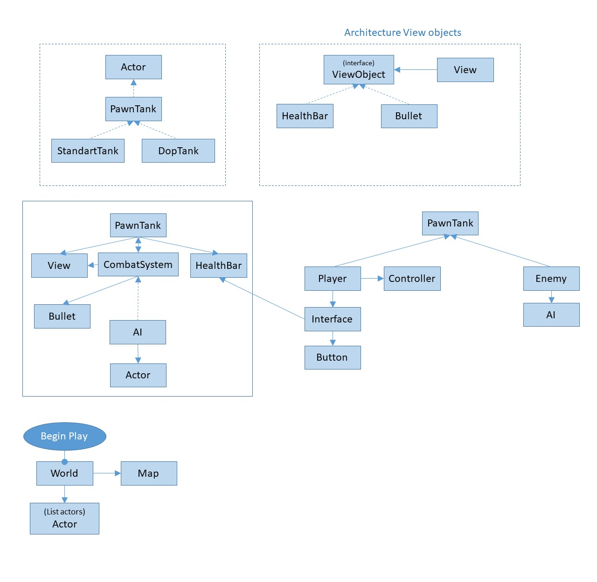
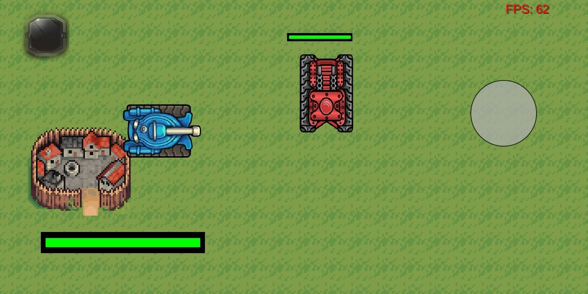
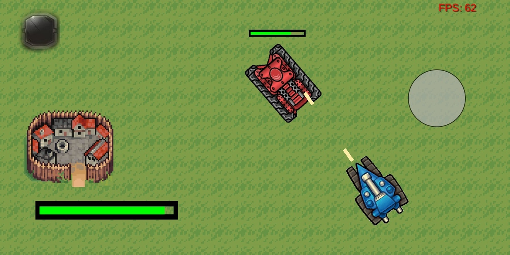

# Milti

Milti - мобильная 2д игра, созданная на фреймворке libgdx на языке java. Это простая игра в жанре танков, загрузкой уровней, выполнений миссий и т.п. 
Данный проект был создан основываясь на архитектурных принципах Yagni, DRY, SOLID. 

На данный момент
---------------------------------
Сейчас в игре существуют 2 танка: танк игрока и патрулирующий танк противника. Есть меню выбора/смены танка. Встроена система стрельбы.

Сервер
---------------------------------
Имеет отдельный серверный модуль. Есть возможность подключения множества игроков для совместной игры. На данный момент модуль является тестовой версией. Он подключает всех игроков присутствующих в игре в одно лобби.
Код сервера: https://github.com/Mer0n1/ServerMilti 

Архитектура
---------------------------------

Примеры
---------------------------------

